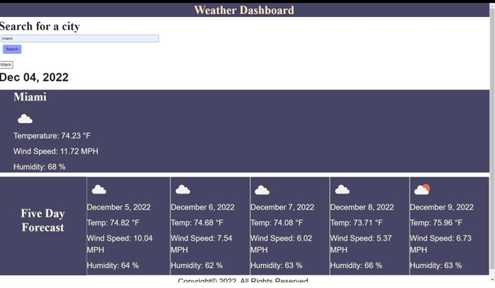

## Weather Dashboard ##

Table of contents:

1. About the proyect
2. Installation
3. Usage
4. Credits
5. License

# About the project #

The main purpose of this project is to people who is going to travel or just check the weather for any city in USA have acces to the current day and the next following days for a specific city, the user will have access to the city name, the date, an icon representation of weather conditions, the temperature, the humidity, and the wind speed. The user can acces all this information and more cities letting him choose where to travel or what things need to be adjusted based on the weather conditions.

# Installation #

N/A

# Usage #

This app can be used by anyone who is interested in the weather conditions for the current day or for the next days in an specific city, and be able to see the city name, the date, an icon representation of weather conditions, the temperature, the humidity, and the wind speed. The user can keep the record of the search history and be able to click in a past city and render the information updated for the current day and the next five day of the weather conditions. Any user can have acces to any weather conditions just from USA cities and be able to make plans considering the weather information. 

The following image shows the web application's appearance and functionality:

link to deployed application:[weather Dashboard]()

# Credits #

N/A

# License #

N/A